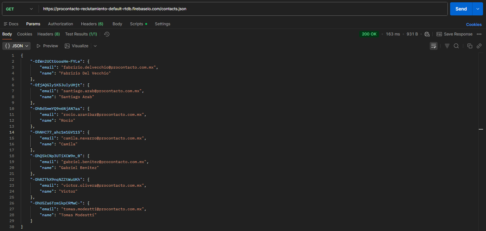
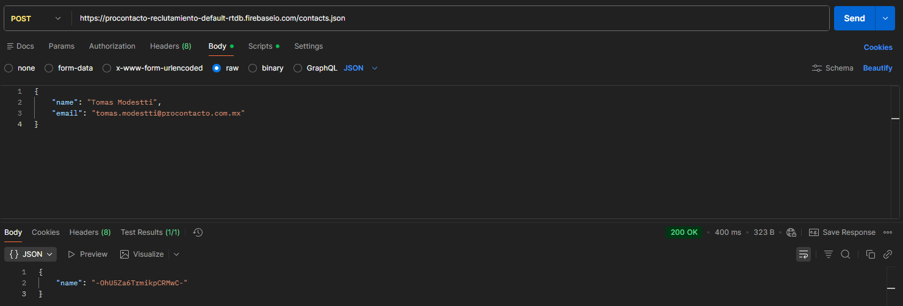
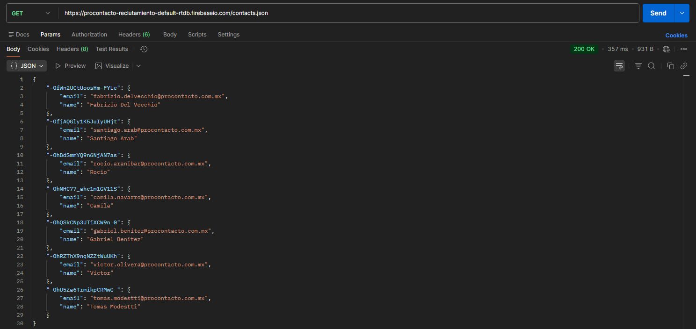
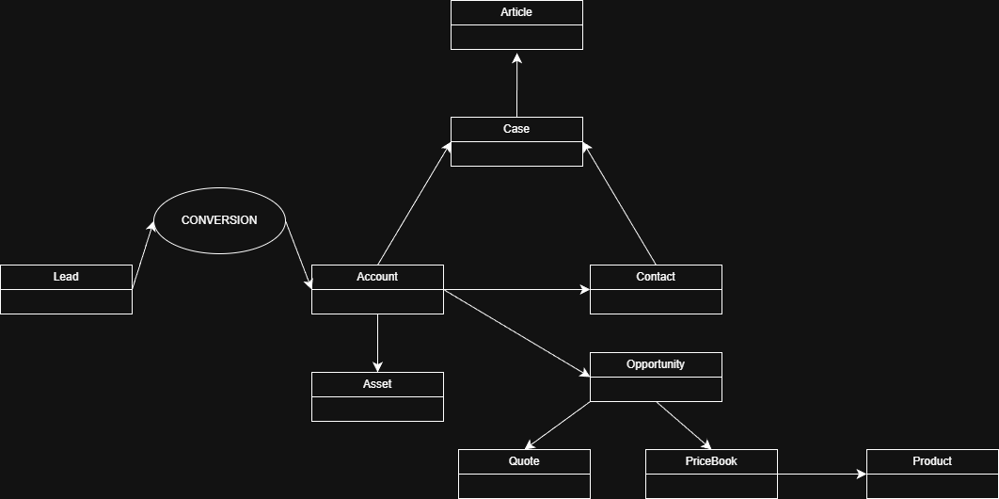
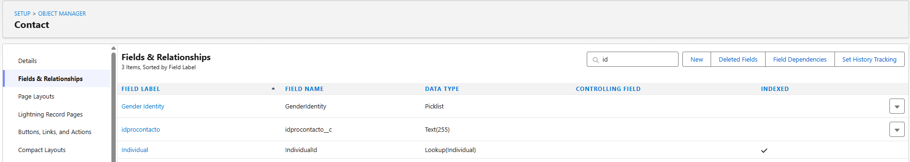

# ProContacto - Evaluación Práctica

Mi nombre es Tomás Agustín Modestti y presento a continuación la resolución de la evaluación práctica solicitada para el proceso de postulación laboral en ProContacto.

## 📑 Índice
1. [Instalación del Ambiente](#ejercicio-1---instalación-del-ambiente-de-desarrollo)
2. [Protocolo HTTP](#ejercicio-2--protocolo-http)
3. [Sintaxis JSON](#ejercicio-3---sintaxis-json)
4. [Trailhead y Capacitación en Salesforce](#ejercicio-4--trailhead-y-capacitación-en-salesforce)
5. [Objetos Estándar de Salesforce](#ejercicio-5---objetos-estándar-de-salesforce)
6. [Preguntas sobre Salesforce](#ejercicio-6---preguntas-sobre-salesforce)
7. [Integración REST y Trigger en Salesforce](#ejercicio-7--integración-rest-y-trigger-en-salesforce)

## Ejercicio 1 - Instalación del Ambiente de Desarrollo

En este ejercicio se realizó la preparación del entorno de trabajo necesario para el desarrollo de la evaluación práctica, asegurando contar con las herramientas utilizadas habitualmente en proyectos dentro de ProContacto.
 
 ### Herramientas instaladas

- **Visual Studio Code** (VS Code): IDE utilizado para el desarrollo de aplicaciones web, móviles y Salesforce. Permite trabajar con múltiples lenguajes como Apex, JavaScript, HTML, CSS y frameworks modernos.

- **Git y Git Bash**: Herramientas utilizadas para el control de versiones del código fuente. Git permite llevar un historial de cambios, facilitar el trabajo colaborativo y mantener el código almacenado de forma remota.

**Evidencia de instalación**

- Visual Studio Code


- Git y Git Bash
  


## Ejercicio 2 – Protocolo HTTP

**1. ¿Qué es un servidor HTTP?**

   Un servidor HTTP es una pieza de software capaz de comprender URLs (direcciones web) y HTTP (el protocolo que el navegador usa para obtener páginas web). Un servidor HTTP puede ser accedido a través de los nombres de dominio de los sitios web que aloja, y entrega el contenido de esos sitios alojados al dispositivo del usuario final.

**2. ¿Qué son los verbos HTTP? Mencionar los más conocidos**

   Los verbos HTTP indican la acción que el cliente desea realizar sobre un recurso en el servidor. Los más conocidos son:
- **GET**: obtiene datos del servidor.
- **HEAD**: solicita únicamente los encabezados de la respuesta HTTP, sin devolver el cuerpo del recurso.
- **POST**: envía datos al servidor, generalmente para crear un nuevo recurso.
- **PUT**: actualiza o reemplaza un recurso existente.
- **PATCH**: modifica ciertos atributos de un recurso existente.
- **DELETE**: elimina un recurso.


**3.¿Qué es un request y un response en una comunicación HTTP?¿Qué son los headers?**

   Un request y un response son mensajes HTTP utilizados para intercambiar información entre el cliente y el servidor. El request es enviado por el cliente al servidor para solicitar un recurso o realizar una acción, mientras que el response es la respuesta del servidor, que contiene el resultado de esa solicitud. Los headers son campos que permiten tanto al cliente como al servidor enviar información adicional junto con una petición o una respuesta. 

**4. ¿Qué es un queryString? (En el contexto de una url)**

   Un queryString es la parte de una URL que permite enviar información adicional al servidor en forma de pares clave=valor. Se encuentra después del signo **?** en la URL y los distintos parámetros se separan con **&**.

**5. ¿Qué es el responseCode? ¿Qué significado tiene los posibles valores devueltos?**

   El responseCode es un valor numérico que el servidor devuelve al cliente dentro de la respuesta HTTP para indicar el resultado de la solicitud realizada. Estos códigos informan si la petición fue exitosa, si ocurrió un error o si se requiere alguna acción adicional.

**6. ¿Cómo se envía la data en un Get y cómo en un POST?**

   En una petición GET, la información se envía a través de la URL, generalmente mediante el queryString, quedando visible para el usuario.
   En una petición POST, la información se envía en el cuerpo (body) de la solicitud HTTP, no siendo visible en la URL y permitiendo enviar mayor cantidad de datos.

**7. ¿Qué verbo http utiliza el navegador cuando accedemos a una página?**

   El navegador, cuando accedemos a una página web, utiliza el verbo HTTP GET para solicitar y obtener el contenido de la misma.

**8. Explicar brevemente qué son las estructuras de datos JSON y XML dando ejemplo de estructuras posibles.**

   JSON es un formato de intercambio de datos liviano y legible por humanos, que representa información mediante pares clave–valor y arreglos. Es muy utilizado en APIs y servicios web. Ejemplo:

```json
{
	"nombre" : "Tomas",
	"dirección": "Peribebuy 4246",
	"estadoCivil": "Soltero",
	"carrera": "Ing. Informática",
	"materiasAprobadas": 36,
	"cursos": 
	[
		{
			"nombre": "React Js",
			"institución": "Talento Tech"
		},
		{
			"nombre”: “Front End",
			"institución": "Talento Tech"
		}
	]
}
```

   XML es un lenguaje de marcado extensible que está diseñado para almacenar datos. Se utiliza popularmente para transferir datos. Es sensible a mayúsculas y minúsculas. Ejemplo: 

```XML
<empresa>
    <departamento>
        <empleado>
            <nombre>Lucia</nombre>
            <cargo>Gerente</cargo>
        </empleado>
    </departamento>
</empresa>
```

**9. Explicar brevemente el estándar SOAP**

   SOAP (Simple Object Access Protocol) es un protocolo estándar utilizado en servicios web que define un conjunto estricto de reglas para estructurar mensajes y permitir la comunicación entre aplicaciones. Los mensajes SOAP están basados en XML y generalmente se transmiten sobre el protocolo HTTP, aunque pueden utilizar otros transportes. Se caracteriza por ser altamente estructurado y formal.

**10.Explicar brevemente el estándar REST Full**

   REST (Representational State Transfer) es un estilo de arquitectura para el diseño de servicios web que se basa en el uso del protocolo HTTP.
   Un servicio RESTful utiliza los verbos HTTP (GET, POST, PUT, DELETE, etc.) para operar sobre recursos identificados por URLs y se caracteriza por ser sin estado (stateless), simple y escalable. Generalmente intercambia datos en formatos como JSON o XML.

**11. ¿Qué son los headers en un request? ¿Para qué se utiliza el key Content-type en un header?**

   Los headers en un request HTTP son campos que permiten enviar información adicional desde el cliente al servidor junto con la solicitud. Se utilizan para indicar datos como el tipo de contenido, autenticación, idioma, codificación o información del cliente.
   El header Content-Type indica el formato del cuerpo (body) del request, permitiendo al servidor interpretar correctamente los datos enviados, por ejemplo:
- “application/json”
- “application/xml”
- “application/x-www-form-urlencoded”

## Ejercicio 3 - Sintaxis JSON

1. Realizar un request GET a la [URL](https://procontacto-reclutamiento-default-rtdb.firebaseio.com/contacts.json)



2. Realizar un request POST a la URL anterior, y con body:
```json
{
    "name":"Tu nombre", 
    "email": tunombre.tuapellido@procontacto.com.mx 
} 
```


3. Realizar nuevamente un request GET a la [URL](https://procontacto-reclutamiento-default-rtdb.firebaseio.com/contacts.json)




**¿Qué diferencias se observan entre las llamadas el punto 1 y 3?**

La diferencia observada entre las llamadas GET del punto 1 y del punto 3 es que, en la segunda llamada (punto 3), aparece el contacto creado mediante el request POST realizado en el punto 2. Esto se debe a que el request POST agrega un nuevo registro en el servidor, el cual queda almacenado en la base de datos. Al volver a realizar el request GET, el servidor devuelve la información actualizada, incluyendo el nuevo contacto, mientras que en el punto 1 dicho registro aún no existía.

## Ejercicio 4 – Trailhead y Capacitación en Salesforce

En este ejercicio se realizó la configuración del entorno de aprendizaje en **Trailhead**, cambiando el idioma de la plataforma a **inglés** para una mejor alineación con la documentación y contenidos técnicos oficiales de Salesforce.

Se completaron los siguientes módulos utilizando el mismo **Playground**:

- Fundamentos de la Plataforma Salesforce  
- Fundamentos de Apex y .NET  
- Modelado de Datos  
- Fundamentos y Base de Datos de Apex  
- Desencadenadores de Apex  
- Apex Integration Services 

### Perfil público de Trailhead

Para validar la resolución de los módulos, se comparte a continuación el enlace al perfil público de Trailhead: [Perfil de Trailhead – Tomás Agustín Modestti](https://www.salesforce.com/trailblazer/tmodestti)

## Ejercicio 5 - Objetos estándar de Salesforce

A continuación se describen conceptualmente los principales objetos estándar de Salesforce, los datos que almacenan y su relación con otros objetos del sistema.

1. **Lead**: es un cliente potencial que demostró interés en un producto o servicio ofrecido por medio de la interacción con contenidos de marca. Almacena información básica de contacto y origen (nombre y apellido, empresa, email, teléfono, país, etc.).
2. **Account**: es una organización, empresa o cliente con el que tu negocio tiene una relación. Es un registro clave que almacena información como el nombre de la empresa, dirección, industria, entre otros. 
3. **Contact**: es una persona asociada a una cuenta o cliente. Los contactos almacenan información como nombre, correo electrónico, teléfono y otros detalles relevantes para gestionar la relación con esa persona.
4. **Opportunity**: es una posible venta o negocio que estás trabajando con un cliente o prospecto. Es un registro clave para rastrear el progreso de las ventas, desde la identificación inicial hasta el cierre, y ayuda a gestionar el pipeline de ventas.
5. **Product**: es un elemento o servicio que una empresa vende a los clientes. 
6. **PriceBook**: es un objeto que define una lista de precios para los productos que una empresa ofrece. Permite gestionar diferentes precios para los mismos productos según el contexto. 
7. **Quote**: es un documento que detalla los productos, servicios y precios ofrecidos a un cliente potencial.
8. **Asset**: es un producto o servicio que un cliente ha comprado. Los activos permiten realizar un seguimiento de los productos adquiridos, su estado, historial de mantenimiento y más. 
9. **Case**: es una solicitud de soporte o problema reportado por un cliente.
10. **Article**: es un recurso de conocimiento que contiene información útil para clientes o empleados, como guías, preguntas frecuentes o soluciones a problemas comunes.

### Diagrama UML - Relaciones entre estándares



## Ejercicio 6 - Preguntas sobre Salesforce

### Soluciones de Salesforce 

**1. ¿Qué es Salesforce?**

Salesforce es una plataforma líder de gestión de relaciones con los clientes (CRM) que ayuda a las empresas a administrar, desarrollar y mejorar sus relaciones con los clientes mediante soluciones basadas en la nube.

**2. ¿Qué es Sales Cloud?**

Sales Cloud es una solución de CRM diseñada para ayudar a los equipos de ventas a gestionar sus actividades, automatizar procesos y aumentar la productividad.

**3. ¿Qué es Service Cloud?**

Service Cloud es una plataforma de atención al cliente que permite a las empresas gestionar y resolver consultas e incidencias de manera eficiente a través de múltiples canales.

**4. ¿Qué es Health Cloud?**

Health Cloud es una plataforma orientada al sector sanitario que centraliza datos clínicos y no clínicos de los pacientes, facilitando una visión integral para mejorar la atención y el seguimiento.

**5. ¿Qué es Marketing Cloud?**

Marketing Cloud es una plataforma de marketing digital que permite personalizar y automatizar campañas a lo largo del ciclo de vida del cliente, gestionando interacciones en canales como correo electrónico, móvil y redes sociales.

### Funcionalidades de Salesforce 
**1.	¿Qué es un RecordType?**

Un RecordType se utiliza para ofrecer diferentes diseños de página, procesos de negocio y valores de lista de selección según el perfil del usuario o el tipo de registro.

**2. ¿Qué es un ReportType?**

Un ReportType define la estructura y los datos disponibles para crear informes.

**3. ¿Qué es un Page Layout?**

Un Page Layout es una herramienta que permite personalizar la disposición de los campos, botones, enlaces y secciones en las páginas de registro de los objetos.

**4. ¿Qué es un Compact Layout?**

Un Compact Layout define qué campos se muestran en la vista de resaltado de un registro, especialmente en aplicaciones móviles y Lightning.

**5. ¿Qué es un Perfil?**

Un perfil define los permisos, accesos y configuraciones que un usuario tiene dentro de la plataforma.

**6. ¿Qué es un Rol?**

Un rol define la jerarquía de acceso a los datos dentro de la organización, determinando qué registros puede ver un usuario según su posición en la estructura organizacional.

**7. ¿Qué es un Validation Rule?**

Una Validation Rule es una regla que verifica que los datos ingresados en un registro cumplan con ciertos criterios antes de ser guardados.

**8. ¿Qué diferencia hay entre una relación Master Detail y Lookup?**

- Lookup: es una relación flexible donde los objetos son independientes; no hereda permisos ni elimina registros relacionados automáticamente.
- Master-Detail: es una relación fuerte donde el objeto detalle depende del objeto maestro; hereda permisos y, al eliminar el maestro, se eliminan automáticamente los registros detalle.

**9. ¿Qué es un Sandbox?**

Un Sandbox es un entorno seguro que replica la organización de producción y se utiliza para desarrollo, pruebas y capacitación sin afectar los datos reales.

**10.	¿Qué es un ChangeSet?**

Un Change Set es una herramienta que permite trasladar configuraciones y desarrollos entre organizaciones de Salesforce, como de un sandbox a producción.

**11.	¿Para qué sirve el import Wizard de Salesforce?**

El Import Wizard se utiliza para importar datos a Salesforce de manera guiada, validando y asignando campos fácilmente. 

**12.	¿Para qué sirve la funcionalidad Web to Lead?**

Web to Lead permite capturar leads automáticamente desde formularios web y almacenarlos directamente en Salesforce.

**13.	¿Para qué sirve la funcionalidad Web to Case?**

Web to Case permite generar casos de soporte automáticamente a partir de formularios web enviados por los clientes.

**14.	¿Para qué sirve la funcionalidad Omnichannel?**

Omnichannel permite distribuir de forma inteligente el trabajo (casos, chats, leads) entre los agentes según disponibilidad y capacidad.

**15.	¿Para qué sirve la funcionalidad Chatter?**

Chatter es una herramienta de colaboración que permite a los usuarios comunicarse, compartir información y trabajar en conjunto dentro de Salesforce.

### Conceptos generales
**1.	¿Qué significa SaaS?**

El Software como Servicio (SaaS) es un modelo de entrega de software basado en la nube, en el cual el proveedor aloja la aplicación y la pone a disposición de los usuarios a través de Internet.

**2.	¿Salesforce es Saas?**

Sí, Salesforce es una solución SaaS, líder especializada en la gestión de relaciones con los clientes (CRM), que se accede mediante Internet sin necesidad de instalación local.

**3.	¿Qué significa que una solución sea Cloud?**

Una solución es Cloud cuando el acceso a los recursos informáticos, aplicaciones y datos se realiza a través de Internet, sin requerir infraestructura local por parte del usuario.

**4.	¿Qué significa que una solución sea On-Premise?**

Una solución On-Premise es aquella que se instala y ejecuta en los servidores e infraestructura propios de la organización, siendo el cliente responsable de su mantenimiento, seguridad y actualizaciones.

**5.	¿Qué es un pipeline de ventas?**

El pipeline de ventas es una representación visual de las etapas del proceso de ventas, que muestra el recorrido de los compradores desde el primer contacto hasta el cierre de la venta, permitiendo gestionar y dar seguimiento a las oportunidades comerciales.

**6.	¿Qué es un funnel de ventas?**

Un funnel de ventas es el modelo que representa cada paso que da un posible cliente, desde que conoce una empresa o producto hasta que realiza una compra.

**7.	¿Qué significa Customer Experience?**

Customer Experience es el conjunto de experiencias, percepciones y momentos que vive un cliente al interactuar con una empresa, desde el primer contacto hasta el uso del producto o servicio y el soporte posventa.

**8.	¿Qué significa omnicanalidad?**

La omnicanalidad es una estrategia que busca brindar una experiencia integrada, coherente y continua al cliente a través de múltiples canales de comunicación, como web, aplicaciones móviles, redes sociales, tiendas físicas y atención telefónica, permitiendo que el cliente se mueva entre ellos sin perder información.

**9.	¿Qué significa que un negocio sea B2B?¿Qué significa que un negocio sea B2C?¿Qué es un KPI?**

- Un negocio B2B (Business to Business) se refiere a transacciones comerciales que se realizan entre empresas, donde se intercambian bienes, servicios o información entre organizaciones.
- Un negocio B2C (Business to Consumer) es un modelo en el cual una empresa vende productos o servicios directamente a consumidores finales para su uso personal.
- Un KPI (Key Performance Indicator) es una métrica cuantitativa utilizada para medir el desempeño de un equipo, proceso u organización en relación con objetivos definidos.

**10.  ¿Qué es una API y en qué se diferencia de una Rest API?**

Una API es un conjunto de reglas o protocolos que permite a las aplicaciones informáticas comunicarse entre sí para intercambiar datos y funcionalidades. Una API REST es un tipo de API que sigue las restricciones de la arquitectura REST, utiliza el protocolo HTTP y emplea sus verbos (GET, POST, PUT, DELETE, HEAD, entre otros) para interactuar con recursos identificados por URLs.

**11.	¿Qué es un Proceso Batch? L. ¿Qué es Kanban? M. ¿Qué es un ERP?**

- Un Proceso Batch es un proceso automatizado que se ejecuta de forma periódica o programada, agrupando tareas similares y realizándolas automáticamente sin intervención humana directa.
- Kanban es una metodología ágil que permite visualizar y gestionar el flujo de trabajo mediante tarjetas o columnas, mostrando el progreso de las tareas desde su inicio hasta su finalización.
- Un ERP (Enterprise Resource Planning) es una herramienta que permite centralizar y gestionar los procesos empresariales, con el objetivo de optimizar la productividad y la toma de decisiones.

**12. ¿Salesforce es un ERP?**

No, Salesforce no es un ERP, sino una plataforma CRM enfocada en la gestión de relaciones con clientes.

## Ejercicio 7 – Integración REST y Trigger en Salesforce

En este ejercicio se implementa una integración entre Salesforce y un servicio web REST externo, utilizando herramientas de consumo de APIs y lógica Apex.  
El objetivo es consultar datos de contactos desde un servicio externo y sincronizar automáticamente la información de correo electrónico en Salesforce mediante un desencadenador (trigger).

### Solución

**1. Consultar tu ID haciendo un GET con POSTMAN a este [WS](https://procontacto-reclutamiento-default-rtdb.firebaseio.com/contacts.json)**

- Mi ID: -OhU5Za6TrmikpCRMwC-

**2. Agregar un campo al objeto Contact llamado idprocontacto de tipo texto de 255 caracteres.**



**3. Desarrollar un desencadenador para que, al modificar o crear un contacto en Salesforce completando el campo generado en el punto B, se invoque el servicio web del punto A. Con el campo idprocontacto de la respuesta, se deberán obtener los datos de correo electrónico y actualizar el campo de correo electrónico del contacto. Utilizar Playground.**
- Recuerda que puedes usar tu ID obtenido en el punto A para probar la funcionalidad.
- Recuerda el módulo realizado sobre callouts de tipo REST.
- Para consultar un contacto en particular se puede agregar al ID al final de la URL como en este ejemplo: https://procontacto-reclutamiento-default-rtdb.firebaseio.com/contacts/-Ma6nC5l7n2nVal2zCyR.json

Componentes desarrollados: 

- [ContactTrigger.cls](./force-app/main/default/classes/ContactTrigger.trigger) : trigger que detecta cambios en el campo `idprocontacto`
- [ProcontactoService.cls](./force-app/main/default/classes/ProcontactoService.cls) : clase de servicio para consumir la API REST
- [ProcontactoQueueable.cls](./force-app/main/default/classes/ProcontactoQueueable.cls) : implementación de Queueable para procesamiento asíncrono


**Agradezco la oportunidad de participar en este proceso.**  
*Quedo a disposición para cualquier consulta o entrevista técnica adicional.*

