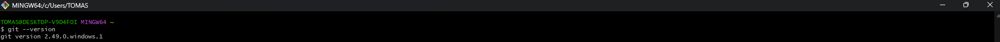

# ProContacto - Evaluación Práctica

Mi nombre es Tomás Agustín Modestti y presento a continuación la resolución de la evaluación práctica solicitada para el proceso de postulación laboral en ProContacto.

## Ejercicio 1 - Instalación del Ambiente de Desarrollo

En este ejercicio se realizó la preparación del entorno de trabajo necesario para el desarrollo de la evaluación práctica, asegurando contar con las herramientas utilizadas habitualmente en proyectos dentro de ProContacto.
 
 **Herramientas instaladas**

- **Visual Studio Code** (VS Code): IDE utilizado para el desarrollo de aplicaciones web, móviles y Salesforce. Permite trabajar con múltiples lenguajes como Apex, JavaScript, HTML, CSS y frameworks modernos.

- **Git y Git Bash**: Herramientas utilizadas para el control de versiones del código fuente. Git permite llevar un historial de cambios, facilitar el trabajo colaborativo y mantener el código almacenado de forma remota.

**Evidencia de instalación**

- Visual Studio Code

- Git y Git Bash
  

